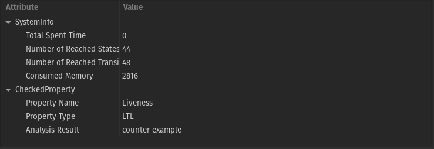

# Memory Anonymous Mutual Exclusion

My 1st project was in the "Verification of Reactive Systems" course when I was in the 2nd semester of my master's at SUT. In this project, I modeled three processes that shared a 5-cell memory without prior agreement based on "Zahra Aghazadeh, Damein Imbs, Michel Raynal, Gadi Taubenfeld, and Philipp Woelfel. Optimal Memory-Anonymous Symmetric Deadlock-Free Mutual Exclusion. PODC ’19: Proceedings of the 2019 ACM Symposium on Principles of Distributed Computing, July 2019, Pages 157–166" paper and verified safety, deadlock, and liveness LTL properties.

## Tutorial Video
In the following tutorial video, I explained every steps of this project : https://youtu.be/hxG6wRs0eOc


## First Version of Rebeca Model

```
reactiveclass Process(10){

	knownrebecs{
		Memory m;
	}
	
	statevars{
		byte uid;
		byte [5] mem;
		byte [5] add;
		boolean winner;
	}		
	
	Process(byte u, byte a, byte b, byte c, byte d, byte e){
		uid = u;
		for(byte i = 0 ; i < 5 ; i++){ mem[i] = 0; }
		add[0] = a;
		add[1] = b;
		add[2] = c;
		add[3] = d;
		add[4] = e;
		winner = false;
		self.init(0);
	}
	
	msgsrv init(int round){
		m.receive(uid,round);
	}
	
	msgsrv get(byte v, int l){
		mem[add[l]-1] = v;
		if(l != 4){
			m.receive(uid,l+1);
		}else{
			byte owner = owned();
			if(owner < findMostPresent()){	
				//loser = true;
				m.result(false,true,uid);
			}else{	
				if(owner == 5){
					winner = true;
					self.crit();
				}else{
					m.result(false,false,uid);
				}	
			}	
		}
	}
	
	msgsrv crit(){
		winner = false;
		m.result(true,false,uid);
	}
	
	msgsrv starter(){
		for(byte i = 0 ; i < 5 ; i++){ mem[i] = 0; }
		m.receive(uid,0);
	}	
	
	byte owned(){
		byte owner = 0;	
		for(byte i = 0 ; i < 5 ; i++){
			if(mem[i] == uid) { owner++; }
		}
		return owner;
	}
	
	byte findMostPresent(){
		byte [5] temp;
		byte mostPresent = 0;
		for(byte i = 0 ; i < 5 ; i++){
			temp[i] = 0;
		}
		for(byte i = 0 ; i < 5 ; i++){
			for(byte j = 0 ; j < 5 ; j++){
				if(mem[i] == mem[j]) { temp[i]++; }
			}
		}
		
		mostPresent = temp[0];
		for(byte i = 1 ; i < 5 ; i++){
			if(mostPresent < temp[i]){ mostPresent = temp[i]; }
		}
		return mostPresent;
	}
		
}	

reactiveclass Memory(25){

	knownrebecs{
		Process p1;
		Process p2;
		Process p3;
	}
	
	statevars{
		byte [5] reg;
		byte [3] p;
		byte cntr;
		byte cv;
	}	
	
	Memory(){
		for(byte i=0 ; i<5 ; i++) { reg[i] = 0; }
		for(byte i=0 ; i<3 ; i++) { p[i] = 0; }
		cntr = 3;
		cv = 3;
	}
	
	msgsrv receive(byte u, int l){
		if(reg[l] == 0) { reg[l] = u; }
		cntr--;
		if(cntr == 0){
			cntr = cv;
			if(p[0] != 1) { p1.get(reg[l],l); }
			if(p[1] != 1) { p2.get(reg[l],l); }
			if(p[2] != 1) { p3.get(reg[l],l); }
		}
	}
	
	msgsrv result(boolean w, boolean l, byte u){
		if(sender == p1){
			if(w == true){ p[0] = 3; }
			if(l == true){ 
				p[0] = 1;
				for(byte i=0 ; i<5 ; i++){
					if(reg[i] == u) { reg[i] = 0; }
				}
			}
			if(w == false && l == false) { p[0] = 2; }
		}
		if(sender == p2){
			if(w == true){ p[1] = 3; }
			if(l == true){ 
				p[1] = 1;
				for(byte i=0 ; i<5 ; i++){
					if(reg[i] == u) { reg[i] = 0; }
				}
			}
			if(w == false && l == false) { p[1] = 2; }
		}
		if(sender == p3){
			if(w == true){ p[2] = 3; }
			if(l == true){ 
				p[2] = 1;
				for(byte i=0 ; i<5 ; i++){
					if(reg[i] == u) { reg[i] = 0; }
				}
			}
			if(w == false && l == false) { p[2] = 2; }
		}
		
		if(p[0] !=0 && p[1] !=0 && p[2] !=0 ){
			cv = 0;
			if(p[0] == 3 || p[1] == 3 || p[2] == 3 ){
				for(byte i=0 ; i<5 ; i++) { reg[i] = 0; }
				for(byte i=0 ; i<3 ; i++) { p[i] = 0; }
				cntr = 3;
				cv = 3;
				p1.starter();
				p2.starter();
				p3.starter();
			}else{
				if(p[0] == 2){ p1.init(0); }
				if(p[1] == 2){ p2.init(0); }
				if(p[2] == 2){ p3.init(0); }
				for(byte i=0 ; i<3 ; i++){
					if(p[i] == 2){
						p[i] = 0;
						cv++;
					}
				}
				cntr = cv;
			}
		}
	}
	
}	

main{
	Process p1(m):(1,1,2,3,4,5);
	Process p2(m):(2,2,3,5,1,4);
	Process p3(m):(3,3,1,4,5,2);
	Memory  m(p1,p2,p3):();
}
```
## LTL properties based on the above model

```
property { 

	define{
		pw1 = p1.winner;
		pw2 = p2.winner;
		pw3 = p3.winner;
		
		mutex1 = !(p1.winner && p2.winner);
		mutex2 = !(p1.winner && p3.winner);
		mutex3 = !(p2.winner && p3.winner);
	}
	
	LTL{
		Safty: G(mutex1) && G(mutex2) && G(mutex3);
		Deadlock:  G(F (pw1 || pw2 || pw3));
		Liveness: F(pw1) && F(pw2) && F(pw3);
	}

}
```

## Result of Model Checking

|  | 
|:--:| 
| *Verification of Safety Property* |

|  | 
|:--:| 
| *Verification of Deadlock Property* |

|  | 
|:--:| 
| *Verification of Liveness Property* |

## Second Version of Rebeca Model

```
reactiveclass Process(10){

	knownrebecs{
		Memory m;
	}
	
	statevars{
		byte uid;
		byte [5] mem;
		byte [5] add;
		boolean winner;
	}		
	
	Process(byte u, byte a, byte b, byte c, byte d, byte e){
		uid = u;
		for(byte i = 0 ; i < 5 ; i++){ mem[i] = 0; }
		add[0] = a;
		add[1] = b;
		add[2] = c;
		add[3] = d;
		add[4] = e;
		winner = false;
		self.init(0);
	}
	
	msgsrv init(int round){
		m.receive(uid,round);
	}
	
	msgsrv get(byte v, int l){
		mem[add[l]-1] = v;
		if(l != 4){
			m.receive(uid,l+1);
		}else{
			byte owner = owned();
			if(owner < findMostPresent()){	
				//loser = true;
				m.result(false,true,uid);
			}else{	
				if(owner == 5){
					winner = true;
					self.crit();
				}else{
					m.result(false,false,uid);
				}	
			}	
		}
	}
	
	msgsrv crit(){
		winner = false;
		m.result(true,false,uid);
	}
	
	msgsrv starter(){
		for(byte i = 0 ; i < 5 ; i++){ mem[i] = 0; }
		m.receive(uid,0);
	}	
	
	byte owned(){
		byte owner = 0;	
		for(byte i = 0 ; i < 5 ; i++){
			if(mem[i] == uid) { owner++; }
		}
		return owner;
	}
	
	byte findMostPresent(){
		byte [5] temp;
		byte mostPresent = 0;
		for(byte i = 0 ; i < 5 ; i++){
			temp[i] = 0;
		}
		for(byte i = 0 ; i < 5 ; i++){
			for(byte j = 0 ; j < 5 ; j++){
				if(mem[i] == mem[j]) { temp[i]++; }
			}
		}
		
		mostPresent = temp[0];
		for(byte i = 1 ; i < 5 ; i++){
			if(mostPresent < temp[i]){ mostPresent = temp[i]; }
		}
		return mostPresent;
	}
		
}	

reactiveclass Memory(25){

	knownrebecs{
		Process p1;
		Process p2;
		Process p3;
	}
	
	statevars{
		byte [5] reg;
		byte [5] swap;
		byte [3] p;
		byte cntr;
		byte cv;
	}	
	
	Memory(){
		for(byte i=0 ; i<5 ; i++) { reg[i] = 0; }
		for(byte i=0 ; i<5 ; i++) { reg[i] = 0; }
		for(byte i=0 ; i<3 ; i++) { p[i] = 0; }
		cntr = 3;
		cv = 3;
	}
	
	msgsrv receive(byte u, int l){
		if(reg[l] == 0) { reg[l] = u; }
		cntr--;
		if(cntr == 0){
			cntr = cv;
			if(p[0] != 1) { p1.get(reg[l],l); }
			if(p[1] != 1) { p2.get(reg[l],l); }
			if(p[2] != 1) { p3.get(reg[l],l); }
		}
	}
	
	msgsrv result(boolean w, boolean l, byte u){
		if(sender == p1){
			if(w == true){ p[0] = 3; }
			if(l == true){ 
				p[0] = 1;
				for(byte i=0 ; i<5 ; i++){
					if(reg[i] == u) { reg[i] = 0; swap[i] = u;}
				}
			}
			if(w == false && l == false) { p[0] = 2; }
		}
		if(sender == p2){
			if(w == true){ p[1] = 3; }
			if(l == true){ 
				p[1] = 1;
				for(byte i=0 ; i<5 ; i++){
					if(reg[i] == u) { reg[i] = 0; swap[i] = u;}
				}
			}
			if(w == false && l == false) { p[1] = 2; }
		}
		if(sender == p3){
			if(w == true){ p[2] = 3; }
			if(l == true){ 
				p[2] = 1;
				for(byte i=0 ; i<5 ; i++){
					if(reg[i] == u) { reg[i] = 0; swap[i] = u;}
				}
			}
			if(w == false && l == false) { p[2] = 2; }
		}
		
		if(p[0] !=0 && p[1] !=0 && p[2] !=0 ){
			cv = 0;
			if(p[0] == 3 || p[1] == 3 || p[2] == 3 ){
				for(byte i=0 ; i<5 ; i++) { reg[i] = 0; }
				for(byte i=0 ; i<5 ; i++){
					if(swap[i] != 0){ reg[i] = swap[i]; }
				}
				for(byte i=0 ; i<3 ; i++) { p[i] = 0; }
				cntr = 3;
				cv = 3;
				p1.starter();
				p2.starter();
				p3.starter();
			}else{
				if(p[0] == 2){ p1.init(0); }
				if(p[1] == 2){ p2.init(0); }
				if(p[2] == 2){ p3.init(0); }
				for(byte i=0 ; i<3 ; i++){
					if(p[i] == 2){
						p[i] = 0;
						cv++;
					}
				}
				cntr = cv;
			}
		}
	}
	
}	

main{
	Process p1(m):(1,1,2,3,4,5);
	Process p2(m):(2,2,3,5,1,4);
	Process p3(m):(3,3,1,4,5,2);
	Memory  m(p1,p2,p3):();
}
```

## LTL properties based on the above model

```
property { 

	define{
		pw1 = p1.winner;
		pw2 = p2.winner;
		pw3 = p3.winner;
		
		mutex1 = !(p1.winner && p2.winner);
		mutex2 = !(p1.winner && p3.winner);
		mutex3 = !(p2.winner && p3.winner);
	}
	
	LTL{
		Safty: G(mutex1) && G(mutex2) && G(mutex3);
		Deadlock:  G(F (pw1 || pw2 || pw3));
		Liveness: F(pw1) && F(pw2) && F(pw3);
	}

}
```
## Result of Model Checking

|  | 
|:--:| 
| *Verification of Safety Property* |

|  | 
|:--:| 
| *Verification of Liveness Property* |

