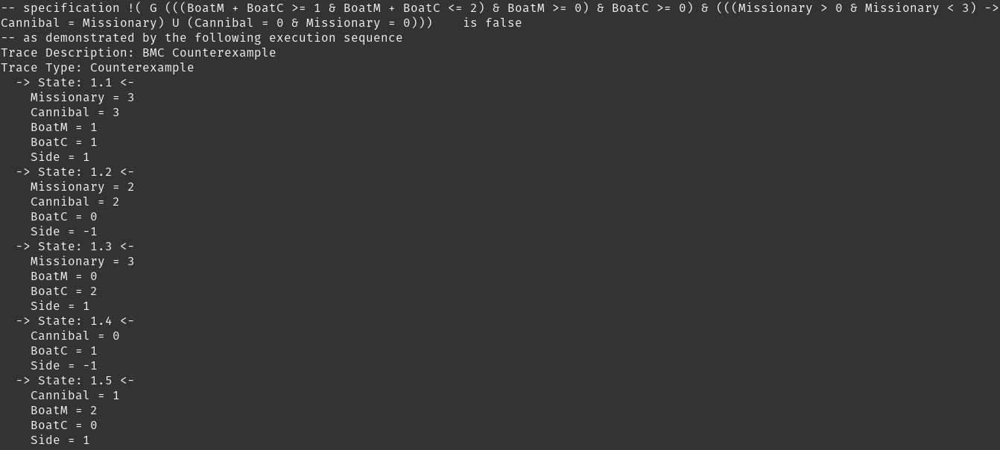
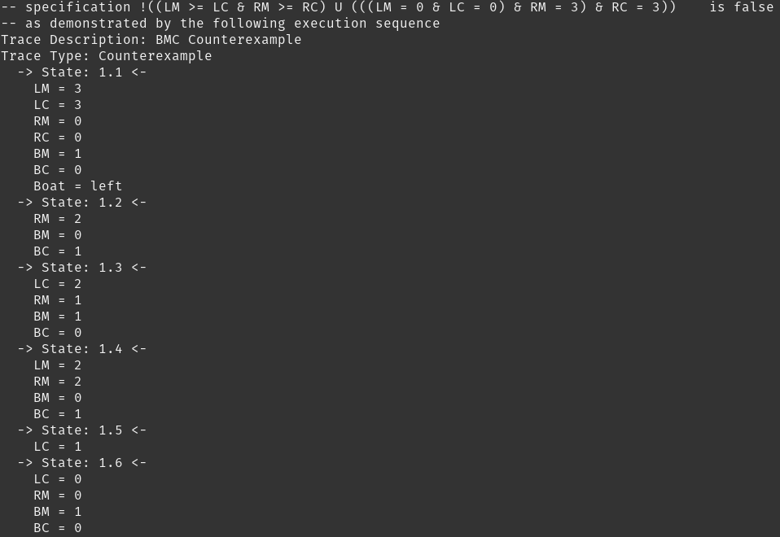

# Missionary Cannibal Problem

My 1st project was in the "Verification of Reactive Systems" course when I was in the 2nd semester of my master's at SUT. In this project I modeled and verified the Missionary Cannibal Problem in two approaches with NuSMV.

## First Approach

```
MODULE main
VAR
    Missionary : 0..3;   
    Cannibal : 0..3;   
    BoatM : 0..2;
    BoatC : 0..2;
    Side : {-1,1};

INIT 
    BoatM + BoatC >= 1;

ASSIGN
    init(Missionary) := 3;
    init(Cannibal) := 3;
    init(Side) := 1;
    next(Cannibal) := Cannibal - (BoatC * Side);
    next(Missionary) := Missionary - (BoatM * Side) ;
    next(Side) := Side * -1;
```
## LTL properties based on the above model

```
LTLSPEC 
    ! ( G(BoatM + BoatC >= 1 & BoatM + BoatC <= 2 & BoatM >=0 & BoatC >= 0) & (((Missionary > 0 & Missionary < 3) -> (Cannibal = Missionary)) U (Cannibal = 0 & Missionary = 0)) );

```

## Result of Model Checking

|  | 
|:--:| 
| *Verification result* |


## Second Approach

```
MODULE main
VAR
    LM : 0..3;
    LC : 0..3;
    RM : 0..3;
    RC : 0..3;
    BM : 0..2;
    BC : 0..2;
    Boat : {left,right};

INVAR 
    BM+BC < 3 & BM+BC > 0 ;
    
INIT 
    BM+BC > 0;

ASSIGN
    init(LM) := 3;
    init(LC) := 3;
    init(RM) := 0;
    init(RC) := 0;
    init(Boat) := left;
    
    next(LM) := case
                    LM!=0 & LM > LC & BM+BC <2 & Boat = left: LM - BM;
                    Boat = right : LM+BM; 
                    TRUE : LM;
                esac;
                
    next(LC) := case
                    LC!=0 & RC < RM & BM+BC <2 & Boat = left: LC - BC;
                    Boat = right : LC+BC;
                    TRUE : LC;
                esac;
                
    next(Boat):= case
                    (Boat = left) & BM+BC = 2 : right;
                    (Boat = right) & BM+BC = 1 : left;
                    TRUE : Boat;
                 esac;
```

## LTL properties based on the above model

```
LTLSPEC
    !((LM >= LC & RM >= RC) U (LM=0 & LC=0 & RM = 3 & RC = 3))       
```
## Result of Model Checking

|  | 
|:--:| 
| *Verification result* |


